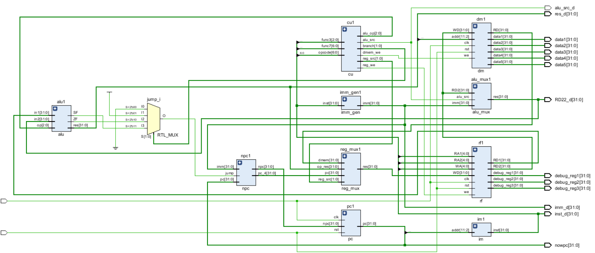
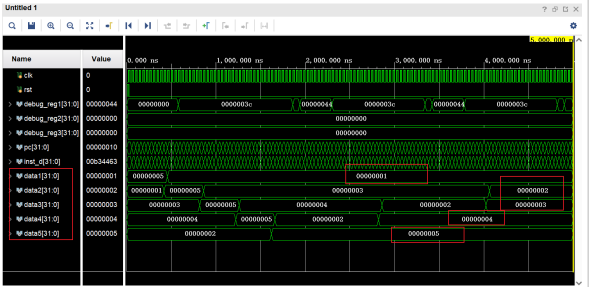

# ⚙RISCV - single cycle CPU

## 环境与工具说明

- Verilog实现
- Vivado进行仿真测试
- RARS 进行RISCV汇编翻译，生成机器码在CPU上运行

## 效果

- 成功实现指令： add, addi, sub, lw, sw, beq,blt, jal, ori
  - 并通过行为仿真波形测试

- 实现的数据通路图：

  ​	

- 完成对5个数的冒泡排序的行为仿真验证

  ​	